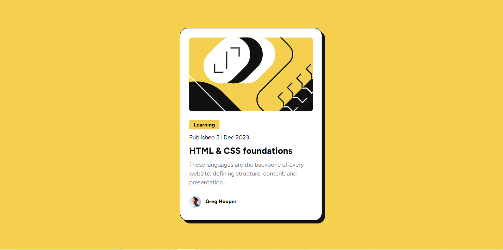

# Frontend Mentor - QR code component solution

This is a solution to the [QR code component challenge on Frontend Mentor](https://www.frontendmentor.io/challenges/qr-code-component-iux_sIO_H). Frontend Mentor challenges help you improve your coding skills by building realistic projects. 

## Table of contents

- [Overview](#overview)
  - [Screenshot](#screenshot)
- [My process](#my-process)
  - [Built with](#built-with)
  - [What I learned](#what-i-learned)
  - [Continued development](#continued-development)
  - [Useful resources](#useful-resources)
- [Author](#author)

## Overview

### Screenshot

## My process

### Built with

- Semantic HTML5 markup
- CSS3
- VS Code Editor

### What I learned

I learned how to use CSS Flexbox to position elements. 

### Continued development

I'd like to become more fluent with sizing and positioning elements using CSS Flexbox. I would like to improve using semantic HTML.

### Useful resources

- (https://www.web.dev/learn) - This is a great resource to learn basic semantic HTML and CSS. The focus on accessibility was very helpful. I like the teaching style and will definitely use this as a reference.

## Author

- Frontend Mentor - [@JNeo77](https://www.frontendmentor.io/profile/JNeo77)